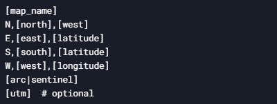
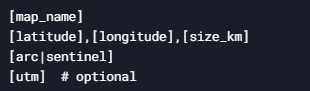

# Map Generator CLI

A command-line tool for downloading and georeferencing satellite imagery from ArcGIS or Sentinel-2.

## Features

- **Sources**:  
  ✅ ArcGIS
  ✅ Sentinel-2 
- **Input Formats**:  
  1. Bounding box coordinates (NESW)  
  2. Center point + radius (km)  
- **Output**: GeoTIFF + JPEG  
- **Auto-Zoom**: Maximizes resolution within 6×6 tile limit  

## Usage

Create Config File (input.txt):
Format 1 (Bounding Box):



Format 2 (Center Point):



last line is the imagery source flag

## Workflow


## Installation

```bash
pip install -r requirements.txt
