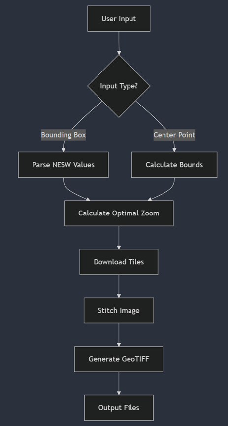

# Map Generator CLI

A command-line tool for downloading and georeferencing satellite imagery from ArcGIS or Sentinel-2.

## Features

- **Sources**:  
  ✅ ArcGIS
  ✅ Sentinel-2 
- **Input Formats**:  
  1. Bounding box coordinates (NESW)  
  2. Center point + radius (km)  
- **Output**: GeoTIFF + JPEG  
- **Auto-Zoom**: Maximizes resolution within 6×6 tile limit  

## Usage

Create Config File (input.txt):
Format 1 (Bounding Box):

my_arcgis_map
N,48.147655,-80.027840  # Northmost lat, West lon
E,48.147555,-79.995609  # Eastmost lat, East lon
S,48.134930,-80.028662  # Southmost lat, West lon
W,48.149551,-80.062613  # Westmost lat, East lon
arc                     # Data source (arc/sentinel)

Format 2 (Center Point):

my_sentinel_map
48.147655,-80.027840,5  # Center lat, Center lon, Radius (km)
sentinel                # Data source (arc/sentinel)

last line is the imagery source flag

## Workflow



## Installation

```bash
pip install -r requirements.txt
